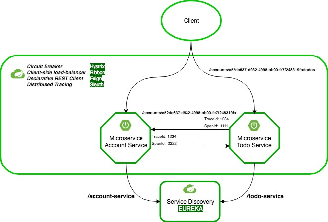

[](https://travis-ci.com/mithie/spring-boot-microservice-demo)
[](https://github.com/mithie/spring-boot-microservice-demo/blob/master/LICENSE)

# Spring Boot Microservice Demo 

This project demonstrates the usage of Spring Boot and Spring Cloud for creating a simple cloud-native eco system.
The concepts shown use several [Spring Boot starters](https://docs.spring.io/spring-boot/docs/current-SNAPSHOT/reference/htmlsingle/#using-boot-starter) which facilitate the creation of Microservice based applications. The features included in this application scenario are outlined below.

To keep things simple there will only be two services interacting with each other for the time being.

- Account Service - A service managing account functionality of a user.
- Todo Service - A simple service managing todos. A Todo will be related to a user's account which makes it necessary for the two services to exchange data.

This repository contains several consecutive git branches where each branch demonstrates a single principle (see [Demonstrated Principles](#demonstrated-principles)) of a Microservice application stack. In order to run the complete stack including all of the explained features in the sub branches you need to check out and build the master branch.

***Note*** that detail descriptions are contained in each sub branch's README.md as well as in the [Detail Description](DETAIL-DESCRIPTION.md) section.

Git sub branches are named with a trailing two-digit number followed by the branch name and highlighted in **bold** font.

Currently the following branches can be checked out separately:
* **01_Initial_Boot_Setup**
* **02_First_Service**
* **03_Service_Discovery**
* **04_Hateoas**
* **05_Eureka_And_Ribbon**
* **06_Feign_And_Hystrix**

Checkout a sub branch
```
git checkout -b [BRANCH_ID]_[BRANCH_NAME] origin/[BRANCH_NAME], e.g. git checkout -b 02_First_Service origin/02_First_Service
```

## Demonstrated Principles

The application will provide a set of common good practices for Microservice development. To get accustomed with general principles of distributed application development a good source of reading as a starter is [The Twelve-Factor App](https://12factor.net/). You'll see a lot of those principles already built-in in Spring Cloud.

### Simple Spring Boot Microservice

**01_Initial_Boot_Setup** and **02_First_Service** demonstrate how to get started with Spring Cloud Microservice Development. In a few simple steps we will see
how easy it is to create a production ready Microservice in almost no time.

### Service Registry and Discovery

**03_Service_Discovery** shows how to set up a service registry in Spring Boot and how to let services communicate with each other through this registry.

### Hateoas Support

**04_Hateoas** makes a short excursion to the field of RESTful API design and how to create [mature](https://martinfowler.com/articles/richardsonMaturityModel.html)
REST APIs.

### Client-side load-balancing with Eureka and Ribbon

**05_Eureka_And_Ribbon** goes one step further into a more advanced topic - client-side load-balancing - which we can use almost out-of-the-box with Spring Cloud's
Ribbon starter project.

### Declarative Service Calls and Fallback behaviour with Feign and Hystrix

**06_Feign_And_Hystrix** shows the use of declarative REST clients and how fallback mechanisms work when a service cannot be reached anymore. Also, testing of Feign with wiremock will be shown.

## Architecture

The following picture gives an overview of the current architecture of our use case and the tooling used so far.



### Main Building Blocks

#### Service Discovery And Service-To-Service Communication
As we can see we have our two Microservices **Account Service** and **Todo Service** which can directly be called by a client application. The call of the Todo Service
with endpoint url **/accounts/a52dc637-d932-4998-bb00-fe7f248319fb/todos** leads to an internal call from **Todo Service** to **Account Service** for the validation of the
passed account id. All of this communication will be done transparently through the Eureka service discovery.

In this scenario a service only needs a minimum configuration
overhead when it wants to talk to other services. The internal service-to-service call is done by a Feign Client interface which will expose an implementation of the interface
at runtime, so that we don't have to bother with any sort of manual wiring. The fact that we are using decalrative Feign interfaces makes our own API more stable and robust.

#### Load Balancing
Additionally we use Ribbon as a client-side load-balancer which comes in pretty handy when we have more than one instance of our service running.
Ribbon will automatically choose the right service instance to call based upon a pre-defined load-balancing rule like round robin,  weighted response time or availability filtering.
Ribbon by default uses round robin as load-balancing rule which works out-of-the-box without much configuration efforts.

See [Ribbon Configuration](https://cloud.spring.io/spring-cloud-netflix/multi/multi_spring-cloud-ribbon.html) for a more detailed overview of possible configuration options.

#### Fallback Behavior
Werner Vogels, VP and CTO at Amazon once said: "everything fails all the time". And he's so right!
There will always be errors which you cannot foresee, especially in a complex distributed environment. We should model our
services in a way that they can cope with such unforeseen errors. Here comes Hystrix for the rescue, a circuit breaker framework originally
developed by Netflix and available as Spring Boot starter application.

Hystrix is pretty cool and provides lots of ways to deal with failing applications. In our example we use a Fallback which will be called
when a service cannot be reached anymore. The Fallback guarantees that a reasonable response will be returned to the consuming client and dependent services won't break.
In traditional monolithic applications a failing service causes all other services in the call chain to fail as well. The result often is unpredicted application behavior
which moreover is pretty hard to debug.

In a distributed system it is absolutely vital that services can act within their own bounded context and are guaranteed to return valid results at any given point in time.

#### Distributed Tracing
In a distributed environment it will soon become quite difficult to keep track of all the different kinds of service communication. If you have an
environment with three or five services manual exploration of log-files might still be manageable somehow. But as soon as your servcie number increases you won't have too much
fun anymore searching for errors in between complex service scenarios.

Therefore we are using Spring Cloud Sleuth, a tooling for distributed tracing which allows us to follow multiple service calls through a unique trace id. Every service in a call chain
will contain the same trace id which makes it much easier to debug a distributed system containing lots of services.

## Detail Description

See [Detail Description](DETAIL-DESCRIPTION.md) for an in-depth explanation of the current features of this demo application.

## How-to run the app

See [How-to run](HOW-TO-RUN.md) for further details.

## References

[Spring Boot 2](https://github.com/spring-projects/spring-boot/wiki/Spring-Boot-2.0-Release-Notes)

[Spring Cloud](https://spring.io/blog/2018/06/19/spring-cloud-finchley-release-is-available)
